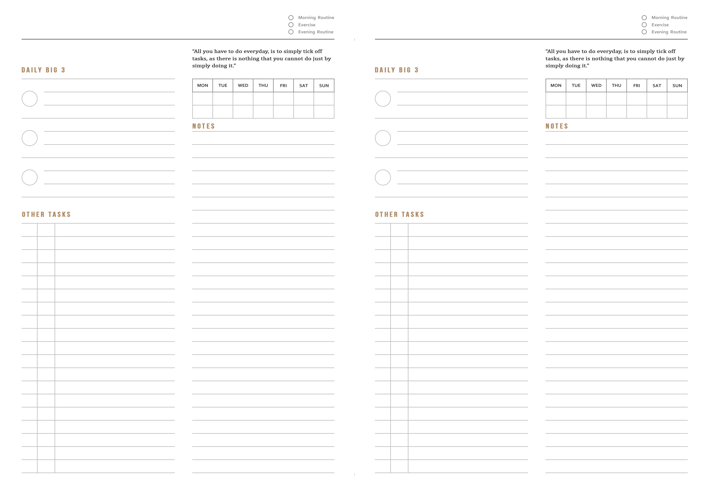

# Daily Planner App (PWA)

A clean, responsive **Progressive Web App (PWA)** for daily planning, built with **React**, **Vite**, and **Firebase Realtime Database**.

I initially designed this daily planner in a [paper format](paper_version.png), which I used for over 2 years, before building this application to go completely paperless.



---

## 🚀 Key Features

* **Daily Tasks & Routines**: Track daily routines, priorities, global task backlog, and archived tasks.
* **Google Authentication & Access Control**: Secure login via Google Sign-In with user avatar, profile badge, and optional email authorization (`REACT_APP_AUTHORIZED_EMAIL`).
* **Real-time Cloud Sync & Demo Mode**: Powered by Firebase Realtime Database for automatic multi-device synchronization, with graceful Demo Mode fallback for unauthenticated or guest users.
* **Progressive Web App (PWA)**: Installable directly on iOS, Android, and Desktop as a standalone native-feeling application with offline support and service worker caching.
* **Weight & Workout Tracker**: Built-in fitness tracking module to record workout sessions and weight metrics.
* **Data Export & Import**: Easy JSON export and import options for full data portability.

---

## 🛠️ Tech Stack

* **Frontend**: React 18, Material UI (MUI v5), Emotion
* **Build Tool & Dev Server**: Vite 5
* **PWA Engine**: `vite-plugin-pwa`, Workbox Service Worker
* **Database & Auth**: Firebase Realtime Database & Firebase Authentication (Google Sign-In)
* **Testing**: Vitest, React Testing Library
* **Styling**: Modular CSS & Material UI Theme System

---

## ⚙️ Getting Started

### 1. Prerequisites & Installation

Clone the repository and install dependencies:

```bash
git clone https://github.com/RedaAlb/daily-planner-app.git
cd daily-planner-app
npm install
```

### 2. Firebase Configuration & Auth Setup

To enable live Firebase sync and Google Authentication for your personal deployment, create a `.env.local` file in the root directory:

```env
REACT_APP_API_KEY="your-api-key"
REACT_APP_AUTH_DOMAIN="your-project.firebaseapp.com"
REACT_APP_DATABASE_URL="https://your-project-default-rtdb.firebaseio.com"
REACT_APP_PROJECT_ID="your-project-id"
REACT_APP_STORAGE_BUCKET="your-project.appspot.com"
REACT_APP_MESSAGING_SENDER_ID="your-sender-id"
REACT_APP_APP_ID="your-app-id"
REACT_APP_AUTHORIZED_EMAIL="your-email@gmail.com"
```

> **Note**: 
> - If `REACT_APP_AUTHORIZED_EMAIL` is set, only that specific Google account will display as authorized for cloud sync.
> - If Firebase environment variables are omitted, the application runs automatically in **Demo Mode** (local preview).

### 3. Available Scripts

* **Start Development Server**:
  ```bash
  npm run start
  ```
  Runs the Vite development server with network host enabled (`http://localhost:3000`).

* **Run Unit Tests**:
  ```bash
  npm test
  ```
  Launches Vitest unit tests in watch mode. Run `npm test -- --run` for single pass execution.

* **Build Production App**:
  ```bash
  npm run build
  ```
  Generates production-optimized web & PWA assets in the `/dist` directory.

---

## 📱 Installing as a PWA on Mobile

Because the app is a PWA, you can install it directly to your phone's home screen without needing app store downloads:

* **iOS (Safari)**: Open the deployed app URL in Safari → Tap **Share** → Tap **Add to Home Screen**.
* **Android (Chrome)**: Open the deployed app URL in Chrome → Tap the 3-dots menu → Tap **Install App** / **Add to Home Screen**.
* **Desktop (Chrome/Edge)**: Click the **Install** button located in the browser's address bar.

---

## 📜 License

This project is licensed under the [MIT License](LICENSE).